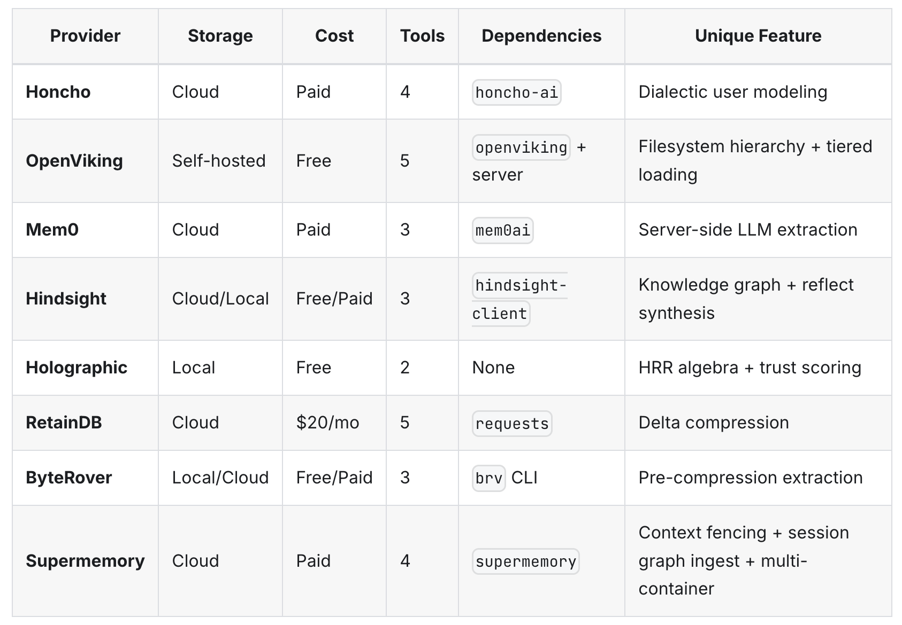

# 2026-04-11 Memory provider comparison

## 说明
这是一张 memory provider 对比表，适合快速比较各方案的存储方式、成本、工具数量、依赖项和独特能力。

## 采集背景
- 这张图来自用户重新发送的图片。
- 相关的 Slack 附件处理背景见 [[2026-04-10-slack-image-download-redirect]]。
- 归档流程与 [[hermes]] 的消息/图片处理工作流有关。

## 表格抄录
| Provider | Storage | Cost | Tools | Dependencies | Unique Feature |
|---|---|---:|---:|---|---|
| Honcho | Cloud | Paid | 4 | `honcho-ai` | Dialectic user modeling |
| OpenViking | Self-hosted | Free | 5 | `openviking` + server | Filesystem hierarchy + tiered loading |
| Mem0 | Cloud | Paid | 3 | `mem0ai` | Server-side LLM extraction |
| Zep | Cloud / Self-hosted | Free / Paid | 3 | `zep-cloud` / `zep` | Relationship-aware context assembly + temporal knowledge graph |
| Letta | Local / Cloud | Free / Paid | 4 | `letta-client` / `letta-code` | Stateful agents + advanced memory blocks |
| Hindsight | Cloud/Local | Free/Paid | 3 | `hindsight-client` | Knowledge graph + reflect synthesis |
| Holographic | Local | Free | 2 | None | HRR algebra + trust scoring |
| RetainDB | Cloud | $20/mo | 5 | `requests` | Delta compression |
| ByteRover | Local/Cloud | Free/Paid | 3 | `brv` CLI | Pre-compression extraction |
| Supermemory | Cloud | Paid | 4 | `supermemory` | Context fencing + session graph ingest + multi-container |
| MemPalace | Local | Free | 5 | `mempalace` | Raw verbatim storage + palace architecture + AAAK compression |

## 关键观察
- 这些方案覆盖了云端、混合和本地三类存储模式。
- 依赖项差异很大：有的偏 SDK/API（如 `honcho-ai`、`mem0ai`、`requests`），有的偏本地 CLI/服务（如 `openviking`、`brv`、`hindsight-client`）。
- 功能侧重点分别落在用户建模、文件系统层级、服务器侧抽取、知识图谱、trust scoring、delta compression 和 session graph ingest 上。
