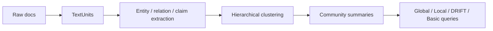

# 2026-04-11 GraphRAG deep research

## 1. 项目概览
GraphRAG 是 Microsoft Research 提出的图谱增强检索范式，仓库 `microsoft/graphrag` 也在持续维护。它不是“向量检索 + 图可视化”的包装，而是一条把 **文本抽取、图构建、社区摘要、分层查询** 串起来的 RAG 管线。

对 AI 工程师来说，GraphRAG 的价值不在“图”这个词本身，而在它把 **corpus understanding** 做成了一个可工程化的流程：
- 输入是原始文本和文档集合
- 中间产物是 TextUnits、entities、relationships、communities、community reports、covariates
- 输出是可分流的 query engines，而不是单一检索结果

它最适合解决的是 **global sensemaking**：当问题不是“找一段相似文本”，而是“这堆资料的主题怎么组织、怎么连线、怎么归纳、怎么追证据”。

## 2. 架构拆解
GraphRAG 的仓库结构很典型，核心在 `packages/graphrag/graphrag/`：

### 索引层
- `index/workflows/factory.py`：把 pipeline 组装成可选工作流
- `index/workflows/extract_graph.py`：LLM 抽实体、关系、主张，再做描述摘要
- `index/workflows/create_communities.py`：基于关系图做层次聚类
- `index/workflows/create_community_reports.py`：生成社区摘要
- `index/workflows/update_entities_relationships.py`：支持增量更新，不是一次性离线脚本

默认标准管线大致是：
`load_input_documents -> create_base_text_units -> create_final_documents -> extract_graph -> finalize_graph -> extract_covariates -> create_communities -> create_final_text_units -> create_community_reports -> generate_text_embeddings`

### 查询层
- `query/factory.py`：构建不同 search engine
- `structured_search/global_search/search.py`
- `structured_search/local_search/search.py`
- `structured_search/drift_search/search.py`
- `structured_search/basic_search/search.py`

GraphRAG 不是一个检索算法，而是四种 query mode：
- **Global Search**：吃 community summaries，解决全局综合题
- **Local Search**：围绕实体与邻居做局部问答
- **DRIFT Search**：local + community context，兼顾局部精度和全局语境
- **Basic Search**：回退到普通 top-k 向量检索

## 3. 核心机制
### 3.1 为什么 GraphRAG 不是普通 RAG
普通 RAG 的默认假设是：
1. 问题能被局部片段回答
2. 相似度召回足够好
3. 取到的若干 chunk 拼起来就能回答

GraphRAG 反过来处理：
- 先把语料压成结构化知识图
- 再把图压成社区摘要
- 最后按问题类型决定是看局部还是看全局

这解决了 baseline RAG 的两个硬伤：
- **连线能力差**：分散信息很难自然串联
- **全局综合差**：主题总结、分布概览、跨文档关系，纯 top-k 往往太局部

### 3.2 索引链路里的关键技术点
- **TextUnit 切分**：GraphRAG 不是直接对文档做一次粗切，而是先把文档变成可分析单元，保证后续引用粒度
- **Graph extraction**：抽实体、关系、主张，本质是把非结构化文本转成近似知识图谱
- **Hierarchical Leiden clustering**：用图聚类得到 community hierarchy，这是它做 global search 的基础
- **Community summarization**：先局部归纳，再层层汇总，避免 query 时临时做大范围总结
- **Incremental update workflows**：说明它考虑了生产场景中的增量维护，而不是纯 notebook demo

### 3.3 Query 路径为什么要分流
不同问题需要不同证据结构：
- 问“某个实体怎么工作的” → Local Search
- 问“整个语料的主题是什么” → Global Search
- 问“局部细节 + 上下文背景” → DRIFT Search
- 问题太普通或图质量不足 → Basic Search 回退

这个设计很像一个 **routing system**，而不是单模型问答。

## 4. 工程权衡
### 优势
- 对长文档集、企业私有语料、研究资料库很强
- 更适合主题穿线、跨文档聚合、概念演化分析
- query mode 清晰，容易做产品分层
- 结果更适合做 evidence-backed answer

### 代价
- 索引成本高，尤其是实体/关系抽取和 community summary
- prompt tuning 影响很大，默认配置不一定好
- 更新维护比轻量检索复杂
- community hierarchy 偏静态聚类，时间维度不是原生强项
- 需要额外做 observability，不然很难知道问题出在抽取、聚类还是摘要

### 实战里最容易踩的坑
- 把它当成“自动知识图谱”而忽略抽取质量
- 不做 prompt tuning 就直接上生产
- 只看最终回答，不看中间产物（entities / relationships / communities / summaries）
- 忽略评估：全局题、局部题、跨文档题应该分别测

## 5. 适合谁
### 适合
- 做长文集研究、专题分析、企业知识库的 AI 工程师
- 需要“全局综合 + 局部证据”的 RAG 系统
- 想研究图增强检索、查询路由、社区摘要的人

### 不适合
- 只要简单 FAQ 或低成本检索的人
- 文档集小、更新频繁、预算有限的产品
- 希望“开箱即满血”的团队

## 6. 我的判断
GraphRAG 的真正价值是把 **图构建、社区摘要、查询分流** 工程化了。它不是“Graphify 的升级版”，也不是“纯 Graph DB + LLM”，而是一种更重但更完整的 corpus-level RAG 架构。

如果我是 AI 工程师，我会把它视为：
- 一个 **高成本、高收益的上层分析能力**
- 一个适合长文集/私有语料的 **global reasoning layer**
- 一个需要严肃评估与 prompt tuning 的系统，而不是功能点

对“Graph 主题文章系列”来说，它应该是一篇方法论主文：重点讲清楚 **为什么它能解决 baseline RAG 的 global reasoning 问题、它的 pipeline 怎么落地、以及它为什么不适合作为轻量检索的默认方案**。
