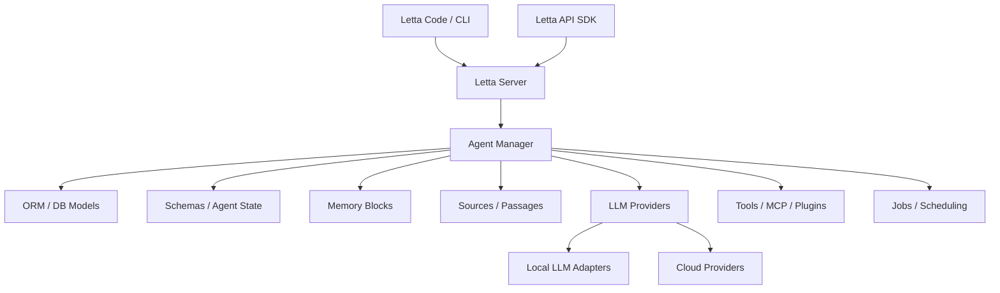

# 2026-04-11 Letta deep research

## 1. 项目概览

Letta 是一个面向 **stateful agents** 的平台，前身是 **MemGPT**。它的官方定位很明确：

- "Build AI with advanced memory that can learn and self-improve over time"
- 提供 **Letta Code**：本地终端里的 agent 运行方式
- 提供 **Letta API**：把有记忆的 agent 嵌入应用中

### 产品定位
Letta 不是一个只负责“存 memory”的单点工具，它更像一个完整的 **agent memory operating layer**：
- 既有 CLI
- 也有 API
- 既支持本地运行
- 也支持服务端部署
- 还带有 multi-agent、MCP、tools、providers、local LLM 适配

### 社区与活跃度
从 GitHub 信号看，Letta 是一个相当成熟的头部开源项目：
- Stars：约 **22k**
- Forks：约 **2.3k**
- Open issues：约 **100+**
- 最近 release：**v0.16.7**（2026-03-31）
- 最近 push：2026-04-08
- License：Apache-2.0

这说明它不是“概念型 demo”，而是持续演进的成熟项目。

## 2. 架构拆解

Letta 的仓库结构非常大，说明它不是单一库，而是一套平台化代码库。可以大致拆成四层：

### 入口层
- `letta/main.py`
- `letta/cli/cli.py`
- `letta/server/server.py`

### 状态与数据层
- `letta/orm/*`
- `letta/schemas/*`
- `letta/services/agent_manager.py`
- `letta/services/conversation_manager.py`
- `letta/services/memory_repo/*`

### 执行与扩展层
- `letta/functions/*`
- `letta/llm_api/*`
- `letta/interfaces/*`
- `letta/groups/*`
- `letta/plugins/*`
- `letta/jobs/*`

### 适配与运行环境层
- `letta/local_llm/*`
- `letta/server/*`
- `compose.yaml` / `dev-compose.yaml`
- `docker-compose-vllm.yaml`

### 架构关系图

### 关键架构观察
1. **Agent state 是中心**
   - 不是把记忆当作附属功能，而是把 agent state 作为系统核心。
2. **Block 是核心记忆单元**
   - `block.py` 把 human/persona/system 等内容建模成 memory block。
3. **服务层很厚**
   - agent / conversation / passage / source / tool / file / group / run / job 都有独立 manager。
4. **兼容面广**
   - 多模型 provider、本地模型、MCP、plugins、multi-agent、voice agent、sleeptime agent 都在一个仓库内。

## 3. 核心机制

### 3.1 Memory blocks
Letta 最核心的概念之一是 memory blocks。

README 的示例里，agent 会带有类似：
- human block
- persona block

在代码里，`letta/orm/block.py` 和 `letta/schemas/block.py` 进一步说明：
- block 是 context 的结构化部分
- block 有 label、value、limit、template、history 等概念
- memory 不是一段单独的文本，而是可管理的结构化块

### 3.2 Stateful agent lifecycle
`letta/services/agent_manager.py` 负责 agent 的生命周期与 memory orchestration，这意味着：
- 创建 agent
- 维护 block 关联
- 管理 sources / passages
- 调整工具与规则
- 处理上下文窗口与状态演化

这比“调用一次 LLM，外面再挂个向量库”要重很多，也更像真正的状态机。

### 3.3 多形态运行
Letta 同时支持：
- 本地终端 agent
- API agent
- 服务端部署
- 多 agent group
- voice / sleeptime 变体

这说明它把 memory 视为一种**跨运行时的底层能力**，不是某个 UI 的附属件。

### 3.4 Memory repo / local fallback
`letta/services/memory_repo/__init__.py` 暗示有一个 git-based memory repository 抽象，并且有 cloud / local fallback 的思路。虽然我这次没有展开读完整实现，但这至少说明 Letta 在尝试把 memory 做成一个可迁移、可落盘、可回退的系统，而不只是在线缓存。

## 4. 优势与不足

### 优势
#### 产品层面
- 定位完整：CLI + API + 运行时 + memory
- 头部开源项目，社区规模和活跃度都不错
- 很适合做“stateful agent”基础设施
- 前身 MemGPT 带来了较强的认知基础和用户心智

#### 技术层面
- 代码分层完整，服务边界清楚
- memory blocks 这个抽象容易落地
- 对 provider / local LLM / MCP / plugin 的兼容性强
- 支持多 agent、多运行形态，扩展空间大

### 不足
#### 产品层面
- 仓库很大，学习曲线高
- 叙事比较“平台化”，对新用户可能偏重
- 同时覆盖 CLI、API、server、多 agent，容易让人觉得边界过宽

#### 技术层面
- 系统复杂度高，维护成本不低
- 多种 agent 类型和运行模式可能带来一致性挑战
- memory blocks 虽然清晰，但如果使用者把它当作“自动记忆魔法”，容易产生误解

## 5. 适合谁

### 最适合
- 想做 **长期有状态 agent** 的团队
- 想研究 agent memory 与 state 管理的工程师
- 想要 CLI / API 双形态产品的开发者
- 想做多模型、MCP、plugin 组合的 agent 平台团队

### 不太适合
- 只想要一个轻量向量记忆层的人
- 只想做简单 RAG，不想承担平台复杂度的人
- 想要极简 SDK 的团队

## 6. 我的判断

Letta 是这份 memory provider 对比里最像“**agent memory 基座**”的项目之一。

如果从研究价值看，我认为它有三个层次的价值：

1. **产品层**：它把 memory 直接做进 agent 生命周期，而不是外挂一个检索模块。
2. **架构层**：它展示了一个完整 stateful agent 平台应该如何分层。
3. **方法论层**：它告诉我们，agent memory 不是“记住几句话”这么简单，而是状态、角色、来源、工具、上下文窗口共同构成的系统。

### 结论
- **值得深挖**
- **非常适合做架构研究对象**
- 如果要从“主流 memory / agent 平台”里挑一个研究，Letta 是强候选

## 公开参考
- Letta docs: https://docs.letta.com/
- GitHub repo: https://github.com/letta-ai/letta
- MemGPT paper / lineage material: https://arxiv.org/search/?query=MemGPT&searchtype=all
